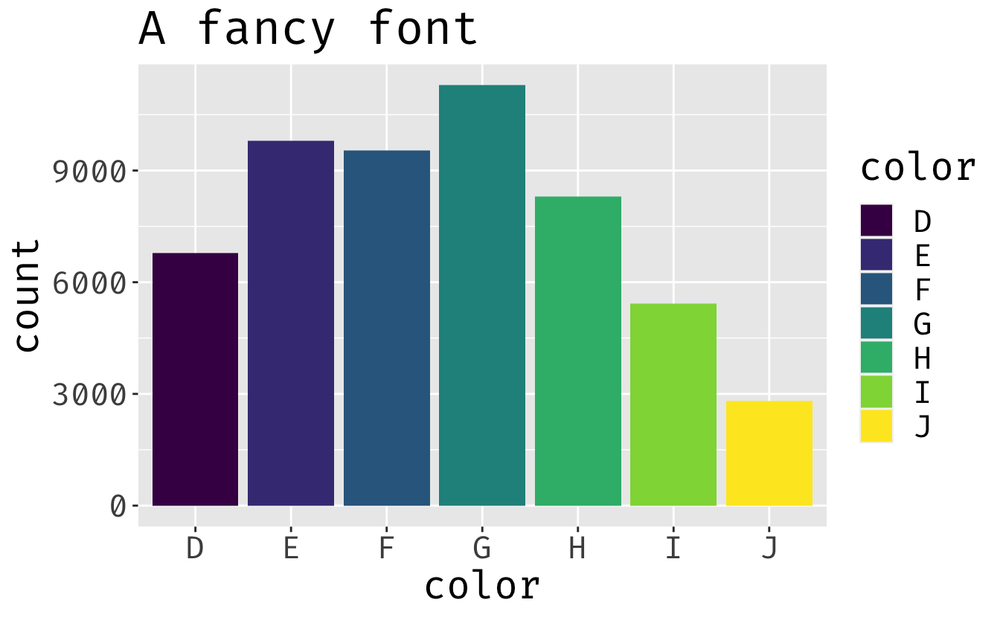
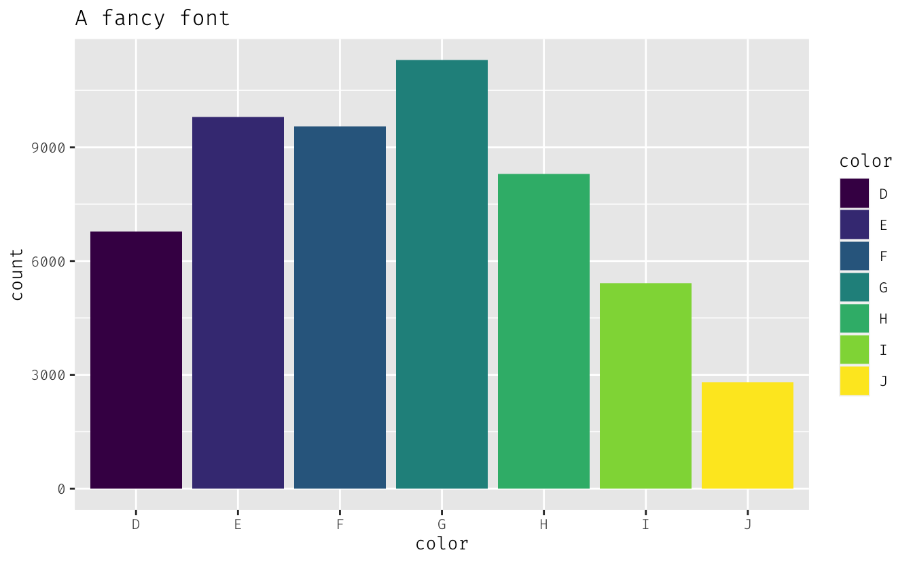

Testing using custom fonts with `ragg`
--------------------------------------

<pre class='chroma'><code class='language-r' data-lang='r'><a href='https://rdrr.io/r/base/library.html'>library</a>(<a href='http://ggplot2.tidyverse.org'>ggplot2</a>)
<a href='https://rdrr.io/r/base/library.html'>library</a>(<a href='https://ragg.r-lib.org'>ragg</a>)</code></pre>

### Using a font saved on my computer as .ttf

<pre class='chroma'><code class='language-r' data-lang='r'><a href='https://ggplot2.tidyverse.org/reference/ggplot.html'>ggplot</a>(diamonds) + 
  <a href='https://ggplot2.tidyverse.org/reference/geom_bar.html'>geom_bar</a>(<a href='https://ggplot2.tidyverse.org/reference/aes.html'>aes</a>(color, fill = color)) + 
  <a href='https://ggplot2.tidyverse.org/reference/labs.html'>ggtitle</a>("A fancy font") + 
  <a href='https://ggplot2.tidyverse.org/reference/theme.html'>theme</a>(text = <a href='https://ggplot2.tidyverse.org/reference/element.html'>element_text</a>(family = "Neutraface Slab Display TT Bold", size = 20))
</code></pre>

### Using a Google Font declared in `emk_font_set2`

<pre class='chroma'><code class='language-r' data-lang='r'><a href='https://ggplot2.tidyverse.org/reference/ggplot.html'>ggplot</a>(diamonds) + 
  <a href='https://ggplot2.tidyverse.org/reference/geom_bar.html'>geom_bar</a>(<a href='https://ggplot2.tidyverse.org/reference/aes.html'>aes</a>(color, fill = color)) + 
  <a href='https://ggplot2.tidyverse.org/reference/labs.html'>ggtitle</a>("A fancy font") + 
  <a href='https://ggplot2.tidyverse.org/reference/theme.html'>theme</a>(text = <a href='https://ggplot2.tidyverse.org/reference/element.html'>element_text</a>(family = "Fira Code", size = 20))
</code></pre>

### Using a variation of a Google Font saved in Font Book

<pre class='chroma'><code class='language-r' data-lang='r'><a href='https://ggplot2.tidyverse.org/reference/ggplot.html'>ggplot</a>(diamonds) + 
  <a href='https://ggplot2.tidyverse.org/reference/geom_bar.html'>geom_bar</a>(<a href='https://ggplot2.tidyverse.org/reference/aes.html'>aes</a>(color, fill = color)) + 
  <a href='https://ggplot2.tidyverse.org/reference/labs.html'>ggtitle</a>("A fancy font") + 
  <a href='https://ggplot2.tidyverse.org/reference/theme.html'>theme</a>(text = <a href='https://ggplot2.tidyverse.org/reference/element.html'>element_text</a>(family = "FiraCode-Light", size = 10))
</code></pre>

-   Using a Google Font NOT declared in `emk_font_set2` does not work.
-   Also, using a .otf font in Font Book doesn't work.
-   Also, using adding `face = "italic"` to `element_text` doesn't work if italic option not specified in font set.

